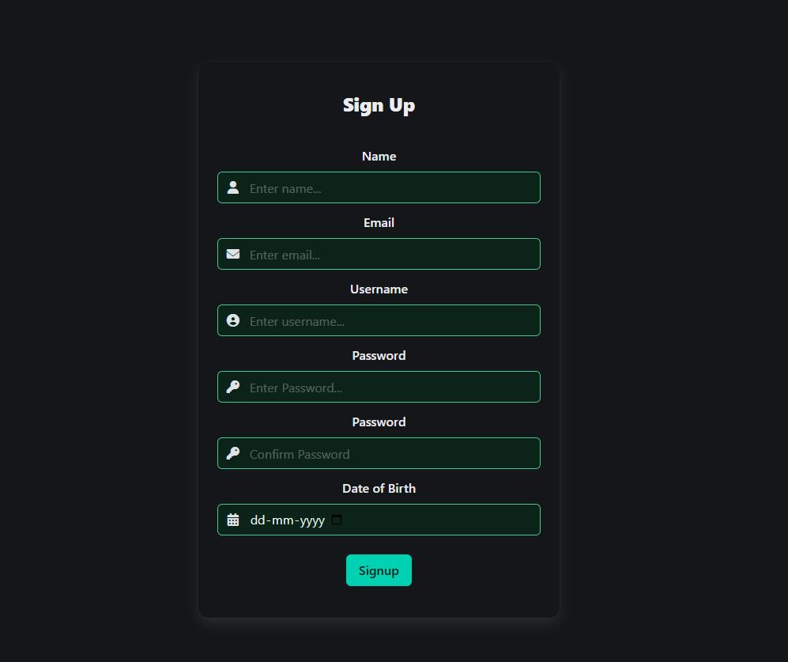

<h1>This is a basic singlepage social media app built using MERN stack.</h1>

<h2>Features</h2>
<ul  style="list-style-type:disc;">
    <li>Sign up using unique usernames and emails.</li>
    <li>Passwords stored in encrypted format using bcryptjs.</li> 
    <li>Send Friend request, remove friends.</li>
    <li>Post, Like and comment on posts.</li>
    <li>Renew Password, delete account.</li>
    <li>Dynamic Alerts when performing an event like incorrect password, sending requests or accepting requests.</li>
</ul>

<h3>How to test?</h3>
<ul style="list-style-type:disc;">
    <li>Install nodeJS globally and MongoDB on your device.</li>
    <li>Install concurrently module (npm install concurrently) in the app folder to run react app and mongodb server concurrently.</li>
</ul>

<h2>Use "npm run both" to start the app</h2>

<h3>Images Below</h3>
<h2>Login Page</h2>

<h2>SignUP Page</h2>

<h2>SignUP Page</h2>

<h2>Settings</h2>

<h2>Friends and Requests</h2>

<h2>Edit Post</h2>

